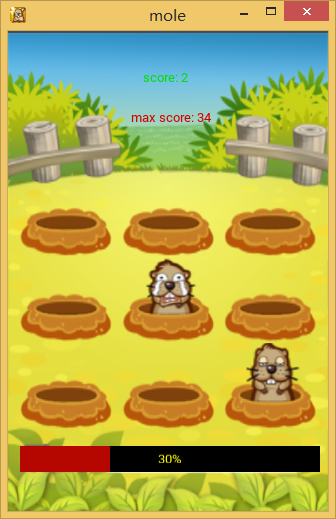

# godot_mole_game

godot engine 制作的打地鼠游戏工程含资源文件源码

===关于 Godot 引擎 ===

Godot 是一个全新开发的游戏引擎，其功能集类似知名的跨平台游戏引擎 Unity，可用于开发 PC、主机、移动和 Web 游戏。开发者声称引擎的 2D 和动画支持要强于 Unity，表示在功能和特性上没有其它开源游戏引擎能相媲美。Godot 引擎内置了类似 Unity 的编辑器，GUI 工具包，2D/3D 物理支持，支持 OpenGL ES 2.0 功能集的 3D 渲染器，易于学习的语言和 API，支持用 ASM.js 或 Google Native Client 输出 HTML5 代码，支持 Linux、Windows 和 OSX 开发平台。

打地鼠项目使用godot编辑器创建，200多行代码（含空行)，请使用godot3.1stable + 执行或发布

游戏截图

2019.3.17 项目更新到当前godot编辑器最新版本 Godot_v3.1-stable

2015.5.24 更新，添加游戏难度，越玩越快，越玩越难。

本项目用到了以下知识点：

1)图片系列帧制作和播放 AnimatedSprite

2)缓动库 tween

3)自定义消息添加和触发(信号和槽) emit_signal

4)2d鼠标捕捉 InputEvent

5)游戏数据的持久化存取 File

Godot游戏引擎讨论QQ群：302924317  

